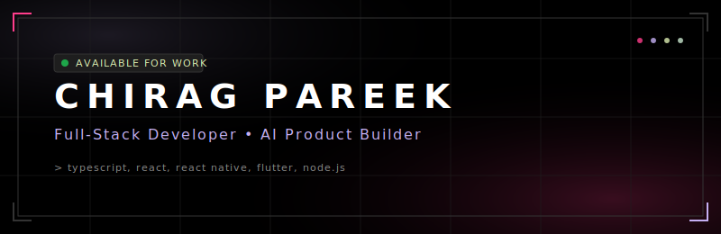

<!-- PREMIUM CUSTOM BANNER -->

 

<!-- DYNAMIC TYPING SVG -->

 

<!-- VIEWS & FOLLOWERS BADGES -->

&nbsp;

---

## 👨‍💻 About Me

<table width="100%" border="0" cellpadding="10" cellspacing="0" style="border-collapse: collapse;">
  <tr>
    <td width="30%" align="center" valign="top" style="border: none;">
      
    </td>
    <td width="70%" valign="top" style="border: none;">
      <pre lang="yaml" style="background-color: #1E1E1E; border: 1px solid #333333; padding: 15px; border-radius: 6px; color: #FFFFFF; font-family: 'JetBrains Mono', monospace;">
name:        Chirag Pareek
location:    India 🇮🇳
role:        Full-Stack Developer & AI Product Builder
focus:       Building beautiful, AI-powered mobile & web experiences
available:   Open to exciting opportunities 🚀
fun_fact:    I ship AI apps that actually get used
      </pre>
    </td>
  </tr>
</table>

---

## 🛠️ Tech Stack

### 💻 Languages & Scripts

### 🚀 Frameworks & Engines

### 🛠️ Infrastructure & Tools

### 🧠 AI & Mobile Systems

---

## 🚀 Featured Projects

<table width="100%" border="0" cellpadding="8" cellspacing="0" style="border-collapse: collapse; margin-top: 15px;">
  <tr>
    <!-- Project 1: WatchFlo -->
    <td width="50%" valign="top" style="border: 1px solid #333333; border-radius: 6px; padding: 15px; background-color: #1E1E1E;">
      

        🎬
        <strong style="font-size: 16px; color: #FFFFFF;">WatchFlo</strong>
      

      

        A cross-platform mobile and web application for tracking and streaming watch progress seamlessly across devices with OTA updates.
      

      

        
        
        
      

      

        <a href="https://github.com/Chirag-Pareek/watchflo-web" style="color: #FF3D8B; text-decoration: none; font-size: 12px; font-weight: bold;">GitHub Code ↗</a>
      

    </td>
    <!-- Project 2: Knovi -->
    <td width="50%" valign="top" style="border: 1px solid #333333; border-radius: 6px; padding: 15px; background-color: #1E1E1E;">
      

        🧠
        <strong style="font-size: 16px; color: #FFFFFF;">Knovi</strong>
      

      

        AI-powered interview simulation platform. Features dynamic topic-based assessments testing real-world knowledge with interactive Rive animations.
      

      

        
        
        
      

      

        <a href="https://knovi-web.vercel.app/" style="color: #FF3D8B; text-decoration: none; font-size: 12px; font-weight: bold; margin-right: 15px;">Live App ↗</a>
        <a href="https://github.com/Chirag-Pareek/Knovi-WebAndApp" style="color: #FF3D8B; text-decoration: none; font-size: 12px; font-weight: bold;">GitHub Code ↗</a>
      

    </td>
  </tr>
  <tr style="height: 15px;"><td colspan="2"></td></tr>
  <tr>
    <!-- Project 3: Mimicly AI -->
    <td width="50%" valign="top" style="border: 1px solid #333333; border-radius: 6px; padding: 15px; background-color: #1E1E1E;">
      

        💬
        <strong style="font-size: 16px; color: #FFFFFF;">Mimicly AI</strong>
      

      

        An AI chat assistant overlay bubble helping you reply like anyone—friends, partners, or professionals—in seconds.
      

      

        
        
        
      

      

        <a href="https://mimicly.netlify.app/" style="color: #FF3D8B; text-decoration: none; font-size: 12px; font-weight: bold; margin-right: 15px;">Live App ↗</a>
        <a href="https://github.com/Chirag-Pareek/Mimicly-AI" style="color: #FF3D8B; text-decoration: none; font-size: 12px; font-weight: bold;">GitHub Code ↗</a>
      

    </td>
    <!-- Project 4: GitDocs+ -->
    <td width="50%" valign="top" style="border: 1px solid #333333; border-radius: 6px; padding: 15px; background-color: #1E1E1E;">
      

        📄
        <strong style="font-size: 16px; color: #FFFFFF;">GitDocs+</strong>
      

      

        All GitHub commands in one modern, interactive developer interface with instant search and one-click copying.
      

      

        
        
        
      

      

        <a href="https://git-docs-one.vercel.app" style="color: #FF3D8B; text-decoration: none; font-size: 12px; font-weight: bold; margin-right: 15px;">Live App ↗</a>
        <a href="https://github.com/Chirag-Pareek/GitDocs-" style="color: #FF3D8B; text-decoration: none; font-size: 12px; font-weight: bold;">GitHub Code ↗</a>
      

    </td>
  </tr>
</table>

---

## 📊 GitHub Analytics

<table border="0" cellpadding="0" cellspacing="0">
  <tr>
    <td align="center" valign="top" style="border: none;">
      
    </td>
    <td width="15" style="border: none;"></td>
    <td align="center" valign="top" style="border: none;">
      
    </td>
  </tr>
</table>

 

<!-- STREAK STATS -->

---

## 🏆 Achievements & Trophies

---

## 📈 Activity & Contribution

<!-- ACTIVITY GRAPH -->

  

<!-- CONTRIBUTION SNAKE -->
<picture>
  <source media="(prefers-color-scheme: dark)" srcset="https://raw.githubusercontent.com/Chirag-Pareek/Chirag-Pareek/output/github-contribution-grid-snake-dark.svg"/>
  <source media="(prefers-color-scheme: light)" srcset="https://raw.githubusercontent.com/Chirag-Pareek/Chirag-Pareek/output/github-contribution-grid-snake-dark.svg"/>
  
</picture>

---

## 🤝 Let's Connect

&nbsp;

&nbsp;

&nbsp;

 

Made with ❤️ by Chirag Pareek — Let's build something amazing together!

